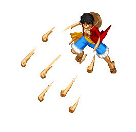

prompt: I want to create a website using html and css about One piece the anime. I want at least 1 header section, a navigation bar with three links, one image, main content area with three sections/articles, a footer with copyright and contact information. for design, use of external css for styling, and the design should be responsive and appealing

ChatGPT
Creating a responsive and appealing website about the anime "One Piece" using HTML and CSS involves several steps. Below is a sample structure and design to get you started.

HTML Code
html
Copy code
<!DOCTYPE html>
<html lang="en">
<head>
    <meta charset="UTF-8">
    <meta name="viewport" content="width=device-width, initial-scale=1.0">
    <title>One Piece Anime</title>
    <link rel="stylesheet" href="styles.css">
</head>
<body>
    <header>
        <h1>One Piece</h1>
    </header>

    <nav>
        <ul>
            <li><a href="#home">Home</a></li>
            <li><a href="#characters">Characters</a></li>
            <li><a href="#episodes">Episodes</a></li>
        </ul>
    </nav>

    <main>
        <section id="home">
            <h2>Welcome to the World of One Piece</h2>
            
One Piece is a Japanese manga series written and illustrated by Eiichiro Oda. It has been serialized in Shueisha's Weekly Shōnen Jump magazine since July 1997.

            
        </section>

        <section id="characters">
            <h2>Main Characters</h2>
            <article>
                <h3>Monkey D. Luffy</h3>
                
Monkey D. Luffy is the main protagonist of the series. He is a pirate with the dream of becoming the Pirate King.

            </article>
            <article>
                <h3>Roronoa Zoro</h3>
                
Roronoa Zoro is a skilled swordsman and a member of the Straw Hat Pirates. He aims to become the world's greatest swordsman.

            </article>
            <article>
                <h3>Nami</h3>
                
Nami is the navigator of the Straw Hat Pirates. She dreams of creating a map of the entire world.

            </article>
        </section>

        <section id="episodes">
            <h2>Top Episodes</h2>
            <article>
                <h3>Episode 1: The Beginning</h3>
                
The first episode introduces us to the world of One Piece and its main protagonist, Monkey D. Luffy.

            </article>
            <article>
                <h3>Episode 101: The Grand Battle</h3>
                
A major turning point in the series where Luffy and his crew face off against a powerful enemy.

            </article>
            <article>
                <h3>Episode 500: The Reunion</h3>
                
An emotional episode where the Straw Hat Pirates reunite after a long separation.

            </article>
        </section>
    </main>

    <footer>
        
&copy; 2024 One Piece Fan Website | Contact: contact@onepiecefan.com

    </footer>
</body>
</html>
CSS Code (styles.css)
css
Copy code
body {
    font-family: Arial, sans-serif;
    margin: 0;
    padding: 0;
    background-color: #f4f4f4;
}

header {
    background-color: #333;
    color: white;
    padding: 1rem 0;
    text-align: center;
}

nav ul {
    list-style: none;
    padding: 0;
    display: flex;
    justify-content: center;
    background-color: #444;
}

nav ul li {
    margin: 0 1rem;
}

nav ul li a {
    color: white;
    text-decoration: none;
    padding: 0.5rem 1rem;
    display: block;
}

nav ul li a:hover {
    background-color: #555;
}

main {
    padding: 2rem;
}

main section {
    margin-bottom: 2rem;
    background-color: white;
    padding: 1rem;
    border-radius: 8px;
    box-shadow: 0 0 10px rgba(0,0,0,0.1);
}

main h2 {
    color: #333;
}

main img {
    max-width: 100%;
    height: auto;
    display: block;
    margin: 1rem 0;
}

footer {
    background-color: #333;
    color: white;
    text-align: center;
    padding: 1rem 0;
}

@media (max-width: 600px) {
    nav ul {
        flex-direction: column;
    }

    nav ul li {
        margin: 0.5rem 0;
    }
}

Explanation
HTML Structure:

A <header> with the title "One Piece".
A <nav> with three links: Home, Characters, and Episodes.
A <main> section with three sections/articles: Welcome, Main Characters, and Top Episodes.
A <footer> with copyright and contact information.
CSS Styling:

The CSS sets a clean, modern design with a consistent font and color scheme.
The navigation bar and footer have a dark background with white text.
The main content area has a white background with a subtle shadow and rounded corners for a card-like appearance.
The layout is responsive, with the navigation bar switching to a vertical layout on smaller screens.
Save the HTML code in an .html file and the CSS code in a .css file. Make sure the CSS file is in the same directory as the HTML file or adjust the href attribute accordingly. This will create a basic, but appealing and responsive website about "One Piece".

prompt: can we make the background the sea in one piece? i would like for you to show me the image you are going to use before integrating it into the site

ChatGPT
I was unable to generate the image you requested because it didn't comply with our content policy. If you have another idea or a specific image you would like to use, please let me know, and I can help you integrate it into the website. Alternatively, you can describe a different concept for the background, and I will try to create it for you.

prompt: what if i find an image for the background?

ChatGPT
If you find an image for the background, you can share it with me, and I'll help you integrate it into the website. Here’s how you can incorporate the image into the CSS:

Save the image in your project directory, preferably in an images folder.
Update the CSS to use this image as the background.
Here’s an example of how you can update your CSS to include a background image:

CSS Code (styles.css) with Background Image
css
Copy code
body {
    font-family: Arial, sans-serif;
    margin: 0;
    padding: 0;
    background: url('images/sea-background.jpg') no-repeat center center fixed;
    background-size: cover;
    color: #fff;
}

header {
    background-color: rgba(0, 0, 0, 0.7);
    color: white;
    padding: 1rem 0;
    text-align: center;
}

nav ul {
    list-style: none;
    padding: 0;
    display: flex;
    justify-content: center;
    background-color: rgba(0, 0, 0, 0.8);
}

nav ul li {
    margin: 0 1rem;
}

nav ul li a {
    color: white;
    text-decoration: none;
    padding: 0.5rem 1rem;
    display: block;
}

nav ul li a:hover {
    background-color: rgba(255, 255, 255, 0.2);
}

main {
    padding: 2rem;
}

main section {
    margin-bottom: 2rem;
    background-color: rgba(0, 0, 0, 0.6);
    padding: 1rem;
    border-radius: 8px;
    box-shadow: 0 0 10px rgba(0,0,0,0.3);
}

main h2 {
    color: #fff;
}

main img {
    max-width: 100%;
    height: auto;
    display: block;
    margin: 1rem 0;
}

footer {
    background-color: rgba(0, 0, 0, 0.8);
    color: white;
    text-align: center;
    padding: 1rem 0;
}

@media (max-width: 600px) {
    nav ul {
        flex-direction: column;
    }

    nav ul li {
        margin: 0.5rem 0;
    }
}

Integrating the Image
Place the image (e.g., sea-background.jpg) in an images folder within your project directory.
Reference the image in the background property of the body selector as shown in the CSS above.
Once you have the image ready, share it with me, and I can help ensure it's correctly integrated into your site.

prompt: is there a way i could add luffy doing gum gum rocket?

ChatGPT
To add an image of Luffy doing the Gum Gum Rocket, you can follow these steps:

Find a suitable image of Luffy performing the Gum Gum Rocket. Make sure you have the right to use the image or that it is free to use.
Save the image in your project directory, preferably in an images folder.
Integrate the image into your HTML and CSS.
Example Integration
1. Save the image
Save the image in a folder named images within your project directory. Name the file something descriptive, like luffy-gum-gum-rocket.png.

2. Update the HTML
Add an img tag within the relevant section of your HTML to display Luffy's image.

html
Copy code
<!DOCTYPE html>
<html lang="en">
<head>
    <meta charset="UTF-8">
    <meta name="viewport" content="width=device-width, initial-scale=1.0">
    <title>One Piece Anime</title>
    <link rel="stylesheet" href="styles.css">
</head>
<body>
    <header>
        <h1>One Piece</h1>
    </header>

    <nav>
        <ul>
            <li><a href="#home">Home</a></li>
            <li><a href="#characters">Characters</a></li>
            <li><a href="#episodes">Episodes</a></li>
        </ul>
    </nav>

    <main>
        <section id="home">
            <h2>Welcome to the World of One Piece</h2>
            
One Piece is a Japanese manga series written and illustrated by Eiichiro Oda. It has been serialized in Shueisha's Weekly Shōnen Jump magazine since July 1997.

            
            
        </section>

        <section id="characters">
            <h2>Main Characters</h2>
            <article>
                <h3>Monkey D. Luffy</h3>
                
Monkey D.

prompt: what about a gif so its almost like an animation?

ChatGPT
To add an animated GIF of Luffy performing the Gum Gum Rocket, follow these steps:

Find or create an animated GIF of Luffy performing the Gum Gum Rocket. Ensure the GIF is free to use or you have the appropriate rights to use it.
Save the GIF in your project directory, preferably in an images folder.
Integrate the GIF into your HTML and CSS.
Example Integration
1. Save the GIF
Save the GIF in a folder named images within your project directory. Name the file something descriptive, like luffy-gum-gum-rocket.gif.

2. Update the HTML
Add an img tag within the relevant section of your HTML to display Luffy's GIF.

html
Copy code
<!DOCTYPE html>
<html lang="en">
<head>
    <meta charset="UTF-8">
    <meta name="viewport" content="width=device-width, initial-scale=1.0">
    <title>One Piece Anime</title>
    <link rel="stylesheet" href="styles.css">
</head>
<body>
    <header>
        <h1>One Piece</h1>
    </header>

    <nav>
        <ul>
            <li><a href="#home">Home</a></li>
            <li><a href="#characters">Characters</a></li>
            <li><a href="#episodes">Episodes</a></li>
        </ul>
    </nav>

    <main>
        <section id="home">
            <h2>Welcome to the World of One Piece</h2>
            
One Piece is a Japanese manga series written and illustrated by Eiichiro Oda. It has been serialized in Shueisha's Weekly Shōnen Jump magazine since July 1997.

            
            
        </section>

        <section id="characters">
            <h2>Main Characters</h2>
            <article>
                <h3>Monkey D. Luffy</h3>
                
Monkey D. Luffy is the main protagonist of the series. He is a pirate with the dream of becoming the Pirate King.

            </article>
            <article>
                <h3>Roronoa Zoro</h3>
                
Roronoa Zoro is a skilled swordsman and a member of the Straw Hat Pirates. He aims to become the world's greatest swordsman.

            </article>
            <article>
                <h3>Nami</h3>
                
Nami is the navigator of the Straw Hat Pirates. She dreams of creating a map of the entire world.

            </article>
        </section>

        <section id="episodes">
            <h2>Top Episodes</h2>
            <article>
                <h3>Episode 1: The Beginning</h3>
                
The first episode introduces us to the world of One Piece and its main protagonist, Monkey D. Luffy.

            </article>
            <article>
                <h3>Episode 101: The Grand Battle</h3>
                
A major turning point in the series where Luffy and his crew face off against a powerful enemy.

            </article>
            <article>
                <h3>Episode 500: The Reunion</h3>
                
An emotional episode where the Straw Hat Pirates reunite after a long separation.

            </article>
        </section>
    </main>

    <footer>
        
&copy; 2024 One Piece Fan Website | Contact: contact@onepiecefan.com

    </footer>
</body>
</html>
3. Update the CSS
Ensure the GIF is displayed properly by updating your CSS if necessary.

css
Copy code
body {
    font-family: Arial, sans-serif;
    margin: 0;
    padding: 0;
    background: url('images/sea-background.jpg') no-repeat center center fixed;
    background-size: cover;
    color: #fff;
}

header {
    background-color: rgba(0, 0, 0, 0.7);
    color: white;
    padding: 1rem 0;
    text-align: center;
}

nav ul {
    list-style: none;
    padding: 0;
    display: flex;
    justify-content: center;
    background-color: rgba(0, 0, 0, 0.8);
}

nav ul li {
    margin: 0 1rem;
}

nav ul li a {
    color: white;
    text-decoration: none;
    padding: 0.5rem 1rem;
    display: block;
}

nav ul li a:hover {
    background-color: rgba(255, 255, 255, 0.2);
}

main {
    padding: 2rem;
}

main section {
    margin-bottom: 2rem;
    background-color: rgba(0, 0, 0, 0.6);
    padding: 1rem;
    border-radius: 8px;
    box-shadow: 0 0 10px rgba(0,0,0,0.3);
}

main h2 {
    color: #fff;
}

main img {
    max-width: 100%;
    height: auto;
    display: block;
    margin: 1rem 0;
}

.gum-gum-rocket {
    max-width: 100%;
    height: auto;
    display: block;
    margin: 1rem auto;
}

footer {
    background-color: rgba(0, 0, 0, 0.8);
    color: white;
    text-align: center;
    padding: 1rem 0;
}

@media (max-width: 600px) {
    nav ul {
        flex-direction: column;
    }

    nav ul li {
        margin: 0.5rem 0;
    }
}
By following these steps, you can integrate an animated GIF of Luffy performing the Gum Gum Rocket into your website, enhancing the visual appeal and interactivity of your content. If you need further assistance with any step, feel free to ask!

prompt: can you add sanji to the character list and can we make the text more center. 

ChatGPT
Sure! Let's add Sanji to the character list and adjust the text alignment to be more centered. We can use Flexbox to center the text within each section and article.

Updated HTML
html
Copy code
<!DOCTYPE html>
<html lang="en">
<head>
    <meta charset="UTF-8">
    <meta name="viewport" content="width=device-width, initial-scale=1.0">
    <title>One Piece Anime</title>
    <link rel="stylesheet" href="styles.css">
</head>
<body>
    <header>
        <h1>One Piece</h1>
    </header>

    <nav>
        <ul>
            <li><a href="#home">Home</a></li>
            <li><a href="#characters">Characters</a></li>
            <li><a href="#episodes">Episodes</a></li>
        </ul>
    </nav>

    <main>
        <section id="home">
            <h2>Welcome to the World of One Piece</h2>
            
One Piece is a Japanese manga series written and illustrated by Eiichiro Oda. It has been serialized in Shueisha's Weekly Shōnen Jump magazine since July 1997.

            
            
        </section>

        <section id="characters">
            <h2>Main Characters</h2>
            <article>
                <h3>Monkey D. Luffy</h3>
                
Monkey D. Luffy is the main protagonist of the series. He is a pirate with the dream of becoming the Pirate King.

            </article>
            <article>
                <h3>Roronoa Zoro</h3>
                
Roronoa Zoro is a skilled swordsman and a member of the Straw Hat Pirates. He aims to become the world's greatest swordsman.

            </article>
            <article>
                <h3>Nami</h3>
                
Nami is the navigator of the Straw Hat Pirates. She dreams of creating a map of the entire world.

            </article>
            <article>
                <h3>Sanji</h3>
                
Sanji is the cook of the Straw Hat Pirates. He dreams of finding the All Blue, a legendary sea.

            </article>
        </section>

        <section id="episodes">
            <h2>Top

prompt: i apologize, i made some changes in some of the image names myself, here is my html

<!DOCTYPE html>
<html lang="en">
<head>
    <meta charset="UTF-8">
    <meta name="viewport" content="width=device-width, initial-scale=1.0">
    <title>One Piece Anime</title>
    <link rel="stylesheet" href="styles.css">
</head>
<body>
    <header>
        <h1>One Piece</h1>
    </header>

    <nav>
        <ul>
            <li><a href="#home">Home</a></li>
            <li><a href="#characters">Characters</a></li>
            <li><a href="#episodes">Episodes</a></li>
        </ul>
    </nav>

    <main>
        <section id="home">
            <h2>Welcome to the World of One Piece</h2>
            
One Piece is a Japanese manga series written and illustrated by Eiichiro Oda. It has been serialized in Shueisha's Weekly Shōnen Jump magazine since July 1997.

            
        </section>

        <section id="characters">
            <h2>Main Characters</h2>
            <article>
                <h3>Monkey D. Luffy</h3>
                
Monkey D. Luffy is the main protagonist of the series. He is a pirate with the dream of becoming the Pirate King.

            </article>
            <article>
                <h3>Roronoa Zoro</h3>
                
Roronoa Zoro is a skilled swordsman and a member of the Straw Hat Pirates. He aims to become the world's greatest swordsman.

            </article>
            <article>
                <h3>Nami</h3>
                
Nami is the navigator of the Straw Hat Pirates. She dreams of creating a map of the entire world.

            </article>
        </section>

        <section id="episodes">
            <h2>Top Episodes</h2>
            <article>
                <h3>Episode 1: The Beginning</h3>
                
The first episode introduces us to the world of One Piece and its main protagonist, Monkey D. Luffy.

            </article>
            <article>
                <h3>Episode 101: The Grand Battle</h3>
                
A major turning point in the series where Luffy and his crew face off against a powerful enemy.

            </article>
            <article>
                <h3>Episode 500: The Reunion</h3>
                
An emotional episode where the Straw Hat Pirates reunite after a long separation.

            </article>
        </section>
    </main>

    <footer>
        
&copy; 2024 One Piece Fan Website | Contact: contact@onepiecefan.com

    </footer>
</body>
</html>

ChatGPT
Great! Let's update the HTML to include Sanji and center the text using Flexbox. Here's the modified version of your HTML and the updated CSS to center the text.

Updated HTML
html
Copy code
<!DOCTYPE html>
<html lang="en">
<head>
    <meta charset="UTF-8">
    <meta name="viewport" content="width=device-width, initial-scale=1.0">
    <title>One Piece Anime</title>
    <link rel="stylesheet" href="styles.css">
</head>
<body>
    <header>
        <h1>One Piece</h1>
    </header>

    <nav>
        <ul>
            <li><a href="#home">Home</a></li>
            <li><a href="#characters">Characters</a></li>
            <li><a href="#episodes">Episodes</a></li>
        </ul>
    </nav>

    <main>
        <section id="home">
            <h2>Welcome to the World of One Piece</h2>
            
One Piece is a Japanese manga series written and illustrated by Eiichiro Oda. It has been serialized in Shueisha's Weekly Shōnen Jump magazine since July 1997.

            
        </section>

        <section id="characters">
            <h2>Main Characters</h2>
            <article>
                <h3>Monkey D. Luffy</h3>
                
Monkey D. Luffy is the main protagonist of the series. He is a pirate with the dream of becoming the Pirate King.

            </article>
            <article>
                <h3>Roronoa Zoro</h3>
                
Roronoa Zoro is a skilled swordsman and a member of the Straw Hat Pirates. He aims to become the world's greatest swordsman.

            </article>
            <article>
                <h3>Nami</h3>
                
Nami is the navigator of the Straw Hat Pirates. She dreams of creating a map of the entire world.

            </article>
            <article>
                <h3>Sanji</h3>
                
Sanji is the cook of the Straw Hat Pirates. He dreams of finding the All Blue, a legendary sea.

            </article>
        </section>

        <section id="episodes">
            <h2>Top Episodes</h2>
            <article>
                <h3>Episode 1: The Beginning</h3>
                
The first episode introduces us to the world of One Piece and its main protagonist, Monkey D. Luffy.

            </article>
            <article>
                <h3>Episode 101: The Grand Battle</h3>
                
A major turning point in the series where Luffy and his crew face off against a powerful enemy.

            </article>
            <article>
                <h3>Episode 500: The Reunion</h3>
                
An emotional episode where the Straw Hat Pirates reunite after a long separation.

            </article>
        </section>
    </main>

    <footer>
        
&copy; 2024 One Piece Fan Website | Contact: contact@onepiecefan.com

    </footer>
</body>
</html>
Updated CSS (styles.css)
css
Copy code
body {
    font-family: Arial, sans-serif;
    margin: 0;
    padding: 0;
    background: url('images/sea-background.jpg') no-repeat center center fixed;
    background-size: cover;
    color: #fff;
}

header {
    background-color: rgba(0, 0, 0, 0.7);
    color: white;
    padding: 1rem 0;
    text-align: center;
}

nav ul {
    list-style: none;
    padding: 0;
    display: flex;
    justify-content: center;
    background-color: rgba(0, 0, 0, 0.8);
}

nav ul li {
    margin: 0 1rem;
}

nav ul li a {
    color: white;
    text-decoration: none;
    padding: 0.5rem 1rem;
    display: block;
}

nav ul li a:hover {
    background-color: rgba(255, 255, 255, 0.2);
}

main {
    padding: 2rem;
    display: flex;
    flex-direction: column;
    align-items: center;
}

main section {
    margin-bottom: 2rem;
    background-color: rgba(0, 0, 0, 0.6);
    padding: 1rem;
    border-radius: 8px;
    box-shadow: 0 0 10px rgba(0,0,0,0.3);
    width: 80%;
    text-align: center;
}

main h2 {
    color: #fff;
}

main img {
    max-width: 100%;
    height: auto;
    display: block;
    margin: 1rem auto;
}

.gum-gum-gatling {
    max-width: 100%;
    height: auto;
    display: block;
    margin: 1rem auto;
}

footer {
    background-color: rgba(0, 0, 0, 0.8);
    color: white;
    text-align: center;
    padding: 1rem 0;
}

@media (max-width: 600px) {
    nav ul {
        flex-direction: column;
    }

    nav ul li {
        margin: 0.5rem 0;
    }

    main section {
        width: 100%;
    }
}
This updated HTML and CSS will include Sanji in the character list and center the text within each section and article using Flexbox. The main tag uses Flexbox to align its children items to the center, and each section/article is given a width of 80% for better centering. The text-align: center property ensures that the text is centered within each section.

prompt: can you add some more information on the episodes?

ChatGPT
Certainly! Here’s the updated HTML with more detailed information for each episode.

Updated HTML with More Detailed Episode Information
html
Copy code
<!DOCTYPE html>
<html lang="en">
<head>
    <meta charset="UTF-8">
    <meta name="viewport" content="width=device-width, initial-scale=1.0">
    <title>One Piece Anime</title>
    <link rel="stylesheet" href="styles.css">
</head>
<body>
    <header>
        <h1>One Piece</h1>
    </header>

    <nav>
        <ul>
            <li><a href="#home">Home</a></li>
            <li><a href="#characters">Characters</a></li>
            <li><a href="#episodes">Episodes</a></li>
        </ul>
    </nav>

    <main>
        <section id="home">
            <h2>Welcome to the World of One Piece</h2>
            
One Piece is a Japanese manga series written and illustrated by Eiichiro Oda. It has been serialized in Shueisha's Weekly Shōnen Jump magazine since July 1997.

            
        </section>

        <section id="characters">
            <h2>Main Characters</h2>
            <article>
                <h3>Monkey D. Luffy</h3>
                
Monkey D. Luffy is the main protagonist of the series. He is a pirate with the dream of becoming the Pirate King.

            </article>
            <article>
                <h3>Roronoa Zoro</h3>
                
Roronoa Zoro is a skilled swordsman and a member of the Straw Hat Pirates. He aims to become the world's greatest swordsman.

            </article>
            <article>
                <h3>Nami</h3>
                
Nami is the navigator of the Straw Hat Pirates. She dreams of creating a map of the entire world.

            </article>
            <article>
                <h3>Sanji</h3>
                
Sanji is the cook of the Straw Hat Pirates. He dreams of finding the All Blue, a legendary sea.

            </article>
        </section>

        <section id="episodes">
            <h2>Top Episodes</h2>
            <article>
                <h3>Episode 1: The Beginning</h3>
                
The first episode introduces us to the world of One Piece and its main protagonist, Monkey D. Luffy. We see Luffy's determination to become the Pirate King as he sets out to find a crew and the legendary One Piece treasure.

            </article>
            <article>
                <h3>Episode 101: The Grand Battle</h3>
                
A major turning point in the series where Luffy and his crew face off against a powerful enemy, Crocodile, in the Alabasta arc. This episode showcases intense battles and the determination of the Straw Hat Pirates to protect their friends.

                <ul>
                    <li>Luffy vs. Crocodile</li>
                    <li>Zoro's determination to become stronger</li>
                    <li>Friendship and loyalty among the crew</li>
                </ul>
            </article>
            <article>
                <h3>Episode 500: The Reunion</h3>
                
An emotional episode where the Straw Hat Pirates reunite after a long separation caused by the events at Sabaody Archipelago. Each member has undergone significant growth and training during their time apart.

                <ul>
                    <li>The emotional return of each crew member</li>
                    <li>Luffy's resolve to protect his friends</li>
                    <li>The beginning of a new adventure</li>
                </ul>
            </article>
        </section>
    </main>

    <footer>
        
&copy; 2024 One Piece Fan Website | Contact: contact@onepiecefan.com

    </footer>
</body>
</html>

Explanation of Additions
Episode 1: The Beginning: Added details about the introduction of the world of One Piece and Luffy's goal.
Episode 101: The Grand Battle: Provided more context about the Alabasta arc, key battles, and character development points.
Episode 500: The Reunion: Included the significance of the crew's reunion, their individual growth, and the start of new adventures.
This additional information helps to give visitors a better understanding of the key episodes and their importance in the One Piece storyline.

prompt: it looks a little off. I think it would look a lot better if we made the episode list left bound instead of center. can we try that?

ChatGPT
Certainly! We can adjust the CSS to ensure that the episode list is left-aligned while keeping the rest of the text centered. Here's the updated CSS and HTML for a better layout.

Updated HTML
html
Copy code
<!DOCTYPE html>
<html lang="en">
<head>
    <meta charset="UTF-8">
    <meta name="viewport" content="width=device-width, initial-scale=1.0">
    <title>One Piece Anime</title>
    <link rel="stylesheet" href="styles.css">
</head>
<body>
    <header>
        <h1>One Piece</h1>
    </header>

    <nav>
        <ul>
            <li><a href="#home">Home</a></li>
            <li><a href="#characters">Characters</a></li>
            <li><a href="#episodes">Episodes</a></li>
        </ul>
    </nav>

    <main>
        <section id="home">
            <h2>Welcome to the World of One Piece</h2>
            
One Piece is a Japanese manga series written and illustrated by Eiichiro Oda. It has been serialized in Shueisha's Weekly Shōnen Jump magazine since July 1997.

            
        </section>

        <section id="characters">
            <h2>Main Characters</h2>
            <article>
                <h3>Monkey D. Luffy</h3>
                
Monkey D. Luffy is the main protagonist of the series. He is a pirate with the dream of becoming the Pirate King.

            </article>
            <article>
                <h3>Roronoa Zoro</h3>
                
Roronoa Zoro is a skilled swordsman and a member of the Straw Hat Pirates. He aims to become the world's greatest swordsman.

            </article>
            <article>
                <h3>Nami</h3>
                
Nami is the navigator of the Straw Hat Pirates. She dreams of creating a map of the entire world.

            </article>
            <article>
                <h3>Sanji</h3>
                
Sanji is the cook of the Straw Hat Pirates. He dreams of finding the All Blue, a legendary sea.

            </article>
        </section>

        <section id="episodes">
            <h2>Top Episodes</h2>
            <article>
                <h3>Episode 1: The Beginning</h3>
                
The first episode introduces us to the world of One Piece and its main protagonist, Monkey D. Luffy. We see Luffy's determination to become the Pirate King as he sets out to find a crew and the legendary One Piece treasure.

            </article>
            <article>
                <h3>Episode 101: The Grand Battle</h3>
                
A major turning point in the series where Luffy and his crew face off against a powerful enemy, Crocodile, in the Alabasta arc. This episode showcases intense battles and the determination of the Straw Hat Pirates to protect their friends.

                <ul>
                    <li>Luffy vs. Crocodile</li>
                    <li>Zoro's determination to become stronger</li>
                    <li>Friendship and loyalty among the crew</li>
                </ul>
            </article>
            <article>
                <h3>Episode 500: The Reunion</h3>
                
An emotional episode where the Straw Hat Pirates reunite after a long separation caused by the events at Sabaody Archipelago. Each member has undergone significant growth and training during their time apart.

                <ul>
                    <li>The emotional return of each crew member</li>
                    <li>Luffy's resolve to protect his friends</li>
                    <li>The beginning of a new adventure</li>
                </ul>
            </article>
        </section>
    </main>

    <footer>
        
&copy; 2024 One Piece Fan Website | Contact: contact@onepiecefan.com

    </footer>
</body>
</html>
Updated CSS (styles.css)
css
Copy code
body {
    font-family: Arial, sans-serif;
    margin: 0;
    padding: 0;
    background: url('images/sea-background.jpg') no-repeat center center fixed;
    background-size: cover;
    color: #fff;
}

header {
    background-color: rgba(0, 0, 0, 0.7);
    color: white;
    padding: 1rem 0;
    text-align: center;
}

nav ul {
    list-style: none;
    padding: 0;
    display: flex;
    justify-content: center;
    background-color: rgba(0, 0, 0, 0.8);
}

nav ul li {
    margin: 0 1rem;
}

nav ul li a {
    color: white;
    text-decoration: none;
    padding: 0.5rem 1rem;
    display: block;
}

nav ul li a:hover {
    background-color: rgba(255, 255, 255, 0.2);
}

main {
    padding: 2rem;
    display: flex;
    flex-direction: column;
    align-items: center;
}

main section {
    margin-bottom: 2rem;
    background-color: rgba(0, 0, 0, 0.6);
    padding: 1rem;
    border-radius: 8px;
    box-shadow: 0 0 10px rgba(0,0,0,0.3);
    width: 80%;
    text-align: center;
}

main section#episodes {
    text-align: left;
}

main h2 {
    color: #fff;
}

main img {
    max-width: 100%;
    height: auto;
    display: block;
    margin: 1rem auto;
}

.gum-gum-gatling {
    max-width: 100%;
    height: auto;
    display: block;
    margin: 1rem auto;
}

footer {
    background-color: rgba(0, 0, 0, 0.8);
    color: white;
    text-align: center;
    padding: 1rem 0;
}

@media (max-width: 600px) {
    nav ul {
        flex-direction: column;
    }

    nav ul li {
        margin: 0.5rem 0;
    }

    main section {
        width: 100%;
    }
}

Explanation
The #episodes section in the HTML remains the same, but its text-align property is adjusted to left in the CSS.
All other sections and articles are centered for consistent styling.
This should result in the episode list being left-aligned while keeping the rest of the content centered. If you have any further adjustments or need additional features, let me know!